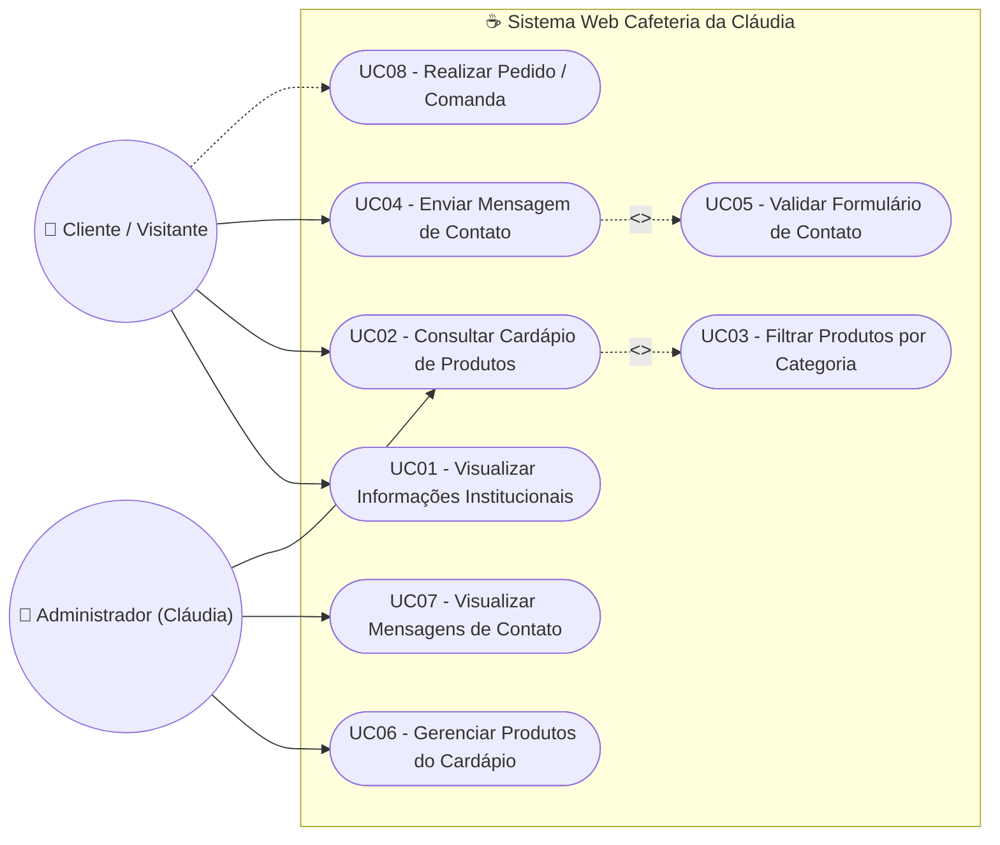
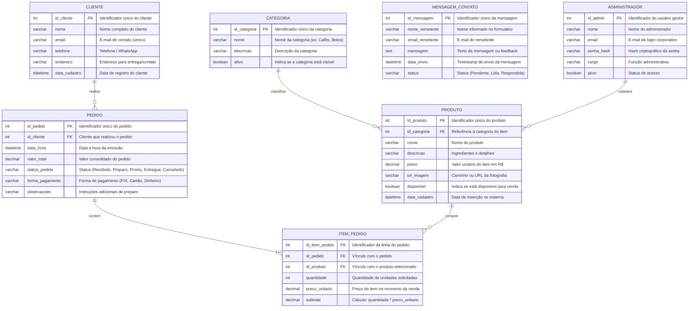

# ☕ Cafeteria da Cláudia - Protótipo Web & Engenharia de Software


> **Documentação de Engenharia de Software**  
> Projeto de prototipagem e modelagem de sistema para a **Cafeteria da Cláudia**, contemplando especificações de requisitos (funcionais e não funcionais), modelagem de casos de uso e modelo entidade-relacionamento (MER).

---

## 📌 Sumário
1. [Visão Geral do Projeto](#-visão-geral-do-projeto)
2. [Tecnologias Utilizadas](#-tecnologias-utilizadas)
3. [Requisitos do Sistema](#-requisitos-do-sistema)
   - [Requisitos Funcionais (RF)](#-requisitos-funcionais-rf)
   - [Requisitos Não Funcionais (RNF)](#-requisitos-não-funcionais-rnf)
4. [Casos de Uso](#-casos-de-uso)
   - [Atores do Sistema](#atores-do-sistema)
   - [Diagrama de Casos de Uso](#diagrama-de-casos-de-uso)
   - [Especificação Detalhada dos Casos de Uso](#especificação-detalhada-dos-casos-de-uso)
5. [Modelo Entidade-Relacionamento (MER / DER)](#-modelo-entidade-relacionamento-mer--der)
   - [Diagrama Entidade-Relacionamento](#diagrama-entidade-relacionamento)
   - [Dicionário de Dados e Entidades](#dicionário-de-dados-e-entidades)
   - [Regras de Integridade e Cardinalidades](#regras-de-integridade-e-cardinalidades)
6. [Estrutura do Projeto](#-estrutura-do-projeto)
7. [Como Executar o Projeto Localmente](#-como-executar-o-projeto-localmente)
8. [Autoria e Créditos Acadêmicos](#-autoria-e-créditos-acadêmicos)

---

## 📖 Visão Geral do Projeto

A **Cafeteria da Cláudia** é uma cafeteria artesanal que busca modernizar seu atendimento e presença digital por meio de uma aplicação web responsiva.

O objetivo do sistema é oferecer uma experiência agradável e intuitiva para os clientes consultarem o cardápio com preços atualizados, conhecerem os horários e localização do estabelecimento, e enviarem dúvidas, elogios ou sugestões por meio de um canal de contato direto. Além do protótipo de front-end interativo implementado em formato SPA (*Single Page Application*), este documento estabelece a base arquitetural para a futura expansão do sistema, englobando a retaguarda de gerenciamento e persistência de dados.

---

## 💻 Tecnologias Utilizadas

- **HTML5 Semântico**: Estruturação acessível das páginas e seções institucionais.
- **CSS3 Moderno**: 
  - Variáveis globais em `:root` para consistência visual.
  - Flexbox e CSS Grid para layouts fluidos e responsivos.
  - Microinterações e animações de transição suave (`fadeIn`, `transform`).
  - *Media Queries* para suporte multiplataforma (mobile-first / desktop).
- **JavaScript (Vanilla JS)**:
  - Controle de navegação SPA sem recarregamento da página.
  - Manipulação de eventos no DOM (menu mobile hamburguer, validação e envio do formulário de contato).
- **Mermaid.js**: Diagramação dos modelos de Casos de Uso e DER integrados ao repositório.

---

## 📋 Requisitos do Sistema

### 📌 Requisitos Funcionais (RF)

Os requisitos funcionais descrevem as funções, comportamentos e interações que o sistema deve fornecer aos usuários.

| Identificador | Nome do Requisito | Descrição Detalhada | Prioridade (MoSCoW) |
| :--- | :--- | :--- | :---: |
| **RF01** | **Apresentação Institucional** | O sistema deve exibir na página inicial a história da cafeteria, proposta de valor, fotos de destaque, endereço físico e horários de funcionamento. | **Must Have** |
| **RF02** | **Navegação Dinâmica (SPA)** | O sistema deve permitir que o usuário transite entre as abas (*Página Inicial*, *Cardápio* e *Contato*) de forma instantânea, sem recarregar a página completa do navegador. | **Must Have** |
| **RF03** | **Consulta ao Cardápio Digital** | O sistema deve exibir os itens disponíveis para venda, acompanhados de imagem ilustrativa, título, descrição dos ingredientes e preço em moeda brasileira (R$). | **Must Have** |
| **RF04** | **Envio de Mensagem de Contato** | O sistema deve permitir que o cliente envie mensagens à cafeteria preenchendo seu nome completo, e-mail e mensagem no formulário dedicado. | **Must Have** |
| **RF05** | **Validação de Formulário** | O sistema deve validar no lado do cliente o preenchimento obrigatório de todos os campos do formulário e o formato válido de e-mail antes do envio. | **Must Have** |
| **RF06** | **Confirmação Visual de Envio** | O sistema deve exibir uma mensagem de sucesso na tela após o envio do formulário, resetar os campos preenchidos e ocultar o aviso automaticamente após 5 segundos. | **Should Have** |
| **RF07** | **Menu Mobile Responsivo** | O sistema deve fornecer um botão de alternância (*hamburger*) para exibição e recolhimento do menu de navegação em dispositivos com largura de tela de até 768px. | **Must Have** |
| **RF08** | **Categorização de Produtos** *(Backoffice)* | O sistema deve permitir organizar os itens do cardápio em categorias (ex.: Cafés Tradicionais, Cafés Especiais, Doces, Salgados, Bebidas Geladas). | **Should Have** |
| **RF09** | **Gerenciamento de Produtos (CRUD)** *(Admin)* | O sistema deve permitir que o administrador cadastre, consulte, atualize dados e altere o status de disponibilidade dos itens do cardápio. | **Should Have** |
| **RF10** | **Gerenciamento de Mensagens** *(Admin)* | O sistema deve armazenar e listar para o administrador as mensagens enviadas pelos clientes, permitindo marcá-las como lidas/respondidas. | **Should Have** |
| **RF11** | **Montagem de Pedido / Comanda** *(Expansão)* | O sistema deve permitir que o cliente adicione produtos ao carrinho, selecione quantidades e visualize o subtotal e o total do pedido. | **Could Have** |

---

### ⚙️ Requisitos Não Funcionais (RNF)

Os requisitos não funcionais definem atributos de qualidade, restrições arquiteturais e critérios de desempenho do sistema, fundamentados no modelo FURPS+ / ISO/IEC 25010.

| Identificador | Categoria | Descrição do Requisito | Critério de Aceitação / Métrica |
| :--- | :--- | :--- | :--- |
| **RNF01** | **Usabilidade (Usability)** | A interface com o usuário deve apresentar identidade visual harmoniosa inspirada em café (paleta de marrons `#6F4E37`, tons terrosos `#D4A373` e neutros `#FDFBF7`), com tipografia de alta legibilidade (Segoe UI / sans-serif) e contraste de cores aderente às diretrizes WCAG 2.1 nível AA. | Taxa de conformidade de contraste mínima de 4.5:1 para textos padrão. |
| **RNF02** | **Desempenho (Performance)** | O sistema deve carregar seus recursos de maneira otimizada, garantindo resposta rápida a interações do usuário. | *First Contentful Paint* (FCP) < 1.5s e tempo de alternância de abas inferior a 100ms. |
| **RNF03** | **Responsividade (Portability)** | A interface deve se adaptar automaticamente a diferentes resoluções de tela, oferecendo layout fluido em smartphones (a partir de 320px), tablets e desktops. | Layout sem quebras e sem barra de rolagem horizontal indesejada em telas de 320px a 4K. |
| **RNF04** | **Compatibilidade (Compatibility)** | A aplicação deve operar de maneira consistente nos principais navegadores web modernos do mercado (Google Chrome, Mozilla Firefox, Microsoft Edge e Safari). | Suporte completo às versões atualizadas dos navegadores baseados em Chromium, Gecko e WebKit. |
| **RNF05** | **Manutenibilidade (Maintainability)** | O código-fonte deve ser limpo, modular, documentado e seguir os padrões de padronização semântica do W3C para HTML5 e CSS3, centralizando variáveis de estilo. | Utilização de variáveis CSS globais (`:root`) e separação lógica de estilos, marcação e scripts. |
| **RNF06** | **Segurança (Security)** | Os formulários de entrada devem possuir sanitização e validação para mitigar vulnerabilidades de injeção de scripts (*Cross-Site Scripting* - XSS) e manipulação de parâmetros. | Bloqueio de submissões inválidas e tratamento prévio de caracteres especiais no front-end e no back-end. |
| **RNF07** | **Confiabilidade e Disponibilidade** | O sistema deve garantir integridade durante as interações do usuário, sem travamentos de script ou perdas involuntárias de dados preenchidos. | Disponibilidade esperada de 99.5% em ambiente de produção web. |

---

## 🎯 Casos de Uso

### Atores do Sistema

- **Cliente / Visitante**: Usuário externo que acessa o site da cafeteria para consultar informações, explorar o cardápio, verificar localização e enviar mensagens ou pedidos.
- **Administrador (Cláudia / Equipe)**: Usuário interno responsável pela gestão do cardápio, acompanhamento de mensagens recebidas e controle operacional da cafeteria.

---

### Diagrama de Casos de Uso



---

### Especificação Detalhada dos Casos de Uso

#### ☕ UC01: Visualizar Informações Institucionais
- **Ator Principal**: Cliente / Visitante.
- **Pré-condições**: O usuário deve ter acesso a um navegador com conexão à internet.
- **Pós-condições**: As informações da cafeteria são exibidas na tela.
- **Fluxo Principal**:
  1. O cliente acessa o endereço da aplicação web.
  2. O sistema carrega a aba inicial (*Home*).
  3. O cliente visualiza a mensagem de boas-vindas, banner principal, história da cafeteria, horários de funcionamento, endereço e telefone.
  4. O cliente pode clicar no botão "Ver Cardápio" para ir diretamente à lista de produtos.

#### 🍰 UC02: Consultar Cardápio de Produtos
- **Ator Principal**: Cliente / Visitante.
- **Pré-condições**: O cliente está na aplicação web.
- **Pós-condições**: Os itens do cardápio são apresentados ao usuário.
- **Fluxo Principal**:
  1. O cliente clica na opção "Cardápio" no menu de navegação ou no botão de chamada na Home.
  2. O sistema exibe o grid de produtos contendo foto, nome, descrição detalhada e preço formatado.
  3. O cliente visualiza e analisa os cafés, doces e salgados disponíveis.
- **Fluxo Alternativo (Filtro por Categoria)**:
  1. No passo 2, o cliente escolhe uma categoria específica (ex.: "Cafés Especiais").
  2. O sistema filtra e exibe apenas os produtos pertencentes à categoria selecionada.

#### ✉️ UC04: Enviar Mensagem de Contato
- **Ator Principal**: Cliente / Visitante.
- **Pré-condições**: O cliente acessou a aba "Contato".
- **Pós-condições**: A mensagem é registrada e enviada à equipe da cafeteria.
- **Fluxo Principal**:
  1. O cliente acessa a aba "Contato" no menu de navegação.
  2. O sistema apresenta o formulário com os campos: Nome, E-mail e Mensagem, juntamente com os dados de contato físico da cafeteria.
  3. O cliente preenche todos os campos com dados válidos e clica no botão "Enviar Mensagem".
  4. O sistema valida os campos (`<<include>> UC05`).
  5. O sistema limpa o formulário e exibe o alerta de confirmação: *"Mensagem enviada com sucesso! Entraremos em contato em breve."*.
  6. Após 5 segundos, o alerta de sucesso é ocultado automaticamente.
- **Fluxo de Exceção (Dados Incompletos ou E-mail Inválido)**:
  1. Se algum dos campos estiver em branco ou o e-mail não contiver formato válido (`@` e domínio), o navegador interrompe o envio e destaca o campo obrigatório com foco.
  2. O formulário não é submetido até que o usuário corrija os dados informados.

#### 🛠️ UC06: Gerenciar Produtos do Cardápio (CRUD)
- **Ator Principal**: Administrador (Cláudia).
- **Pré-condições**: O administrador deve estar autenticado no painel de gestão.
- **Pós-condições**: O catálogo de produtos é atualizado na base de dados e refletido no cardápio online.
- **Fluxo Principal**:
  1. O administrador acessa a área de gestão de produtos.
  2. O sistema lista todos os produtos cadastrados com opções de: *Adicionar Novo*, *Editar*, *Alterar Preço* e *Desativar/Ativar*.
  3. O administrador realiza a operação desejada preenchendo os dados do produto (nome, categoria, descrição, valor e link da imagem).
  4. O sistema valida os dados e confirma a persistência da alteração.

#### 📬 UC07: Visualizar Mensagens de Contato
- **Ator Principal**: Administrador (Cláudia).
- **Pré-condições**: O administrador está autenticado no painel de gestão.
- **Pós-condições**: As mensagens dos clientes são lidas e gerenciadas.
- **Fluxo Principal**:
  1. O administrador acessa a caixa de mensagens de contato.
  2. O sistema lista as mensagens recebidas ordenadas pela data/hora de envio mais recente.
  3. O administrador seleciona uma mensagem para visualizar o conteúdo completo, dados de contato do cliente e registrar respostas.

---

## 🗄️ Modelo Entidade-Relacionamento (MER / DER)

O Modelo Entidade-Relacionamento foi projetado para sustentar as funcionalidades atuais do protótipo e permitir a expansão completa para gestão de estoque, pedidos e clientes.

### Diagrama Entidade-Relacionamento



---

### Dicionário de Dados e Entidades

#### 1. Entidade: `CATEGORIA`
Classifica os itens do cardápio em seções comerciais.
- `id_categoria` (INT, PK, Auto Increment): Código identificador único da categoria.
- `nome` (VARCHAR(50), NOT NULL): Nome da categoria (ex.: *Cafés Especiais*, *Salgados*, *Sobremesas*).
- `descricao` (VARCHAR(200), NULL): Breve resumo do agrupamento de produtos.
- `ativo` (BOOLEAN, DEFAULT TRUE): Controle de exibição no cardápio público.

#### 2. Entidade: `PRODUTO`
Registra cada item comercializado pela Cafeteria da Cláudia.
- `id_produto` (INT, PK, Auto Increment): Código identificador do produto.
- `id_categoria` (INT, FK, NOT NULL): Chave estrangeira que referencia a tabela `CATEGORIA`.
- `nome` (VARCHAR(100), NOT NULL): Nome comercial do produto (ex.: *Café Espresso*, *Cappuccino Cremoso*).
- `descricao` (VARCHAR(255), NOT NULL): Detalhamento do produto e ingredientes.
- `preco` (DECIMAL(10,2), NOT NULL): Valor monetário do item.
- `url_imagem` (VARCHAR(255), NOT NULL): Endereço URI da foto ilustrativa do produto.
- `disponivel` (BOOLEAN, DEFAULT TRUE): Flag que indica se o produto está em estoque/disponível.
- `data_cadastro` (DATETIME, DEFAULT CURRENT_TIMESTAMP): Timestamp de registro do item.

#### 3. Entidade: `CLIENTE`
Armazena dados de visitantes que realizam pedidos ou criam conta no sistema.
- `id_cliente` (INT, PK, Auto Increment): Identificador do cliente.
- `nome` (VARCHAR(100), NOT NULL): Nome completo do cliente.
- `email` (VARCHAR(100), UNIQUE, NOT NULL): Endereço de e-mail do cliente.
- `telefone` (VARCHAR(20), NULL): Número de telefone ou WhatsApp para contato.
- `endereco` (VARCHAR(255), NULL): Endereço para entregas locais.
- `data_cadastro` (DATETIME, DEFAULT CURRENT_TIMESTAMP): Data de inclusão do registro.

#### 4. Entidade: `MENSAGEM_CONTATO`
Registra os contatos, dúvidas, elogios e feedbacks enviados através da página "Contato".
- `id_mensagem` (INT, PK, Auto Increment): Código identificador da mensagem.
- `nome_remetente` (VARCHAR(100), NOT NULL): Nome fornecido no formulário.
- `email_remetente` (VARCHAR(100), NOT NULL): E-mail para resposta.
- `mensagem` (TEXT, NOT NULL): Conteúdo textual enviado pelo cliente.
- `data_envio` (DATETIME, DEFAULT CURRENT_TIMESTAMP): Data e horário de recebimento.
- `status` (VARCHAR(20), DEFAULT 'Pendente'): Situação da mensagem (*Pendente*, *Lida*, *Respondida*).

#### 5. Entidade: `ADMINISTRADOR`
Armazena os usuários autorizados a gerenciar produtos e mensagens da cafeteria.
- `id_admin` (INT, PK, Auto Increment): Código do usuário administrador.
- `nome` (VARCHAR(100), NOT NULL): Nome completo do colaborador.
- `email` (VARCHAR(100), UNIQUE, NOT NULL): Login de acesso.
- `senha_hash` (VARCHAR(255), NOT NULL): Senha criptografada (ex.: BCrypt / Argon2).
- `cargo` (VARCHAR(50), NOT NULL): Nível de permissão (ex.: *Gerente*, *Atendente*).
- `ativo` (BOOLEAN, DEFAULT TRUE): Controle de bloqueio/acesso do usuário.

#### 6. Entidade: `PEDIDO`
Armazena os cabeçalhos de pedidos e comandas realizados.
- `id_pedido` (INT, PK, Auto Increment): Número do pedido.
- `id_cliente` (INT, FK, NOT NULL): Vínculo com o cliente que solicitou o pedido.
- `data_hora` (DATETIME, DEFAULT CURRENT_TIMESTAMP): Momento exato da criação do pedido.
- `valor_total` (DECIMAL(10,2), NOT NULL): Valor total somado de todos os itens e taxas.
- `status_pedido` (VARCHAR(30), DEFAULT 'Recebido'): Situação (*Recebido*, *Em Preparo*, *Pronto para Retirada*, *Entregue*, *Cancelado*).
- `forma_pagamento` (VARCHAR(30), NOT NULL): Método escolhido (*PIX*, *Cartão de Crédito*, *Cartão de Débito*, *Dinheiro*).
- `observacoes` (VARCHAR(255), NULL): Notas personalizadas (ex.: *leite sem lactose*, *pouco açúcar*).

#### 7. Entidade: `ITEM_PEDIDO`
Tabela associativa que resolve o relacionamento N:M entre `PEDIDO` e `PRODUTO`.
- `id_item_pedido` (INT, PK, Auto Increment): Identificador do item no pedido.
- `id_pedido` (INT, FK, NOT NULL): Referência ao pedido pai (`ON DELETE CASCADE`).
- `id_produto` (INT, FK, NOT NULL): Referência ao produto consumido (`ON DELETE RESTRICT`).
- `quantidade` (INT, NOT NULL): Número de unidades do produto.
- `preco_unitario` (DECIMAL(10,2), NOT NULL): Preço histórico do produto no momento do fechamento.
- `subtotal` (DECIMAL(10,2), NOT NULL): Resultado de `quantidade * preco_unitario`.

---

### Regras de Integridade e Cardinalidades

1. **`CATEGORIA` (1) ──── (0..N) `PRODUTO`**:
   - Uma categoria pode agrupar múltiplos produtos.
   - Cada produto pertence obrigatoriamente a uma única categoria (`id_categoria` NOT NULL).
2. **`CLIENTE` (1) ──── (0..N) `PEDIDO`**:
   - Um cliente cadastrado pode realizar zero ou vários pedidos ao longo do tempo.
   - Todo pedido é originado por um cliente associado.
3. **`PEDIDO` (1) ──── (1..N) `ITEM_PEDIDO`**:
   - Todo pedido válido deve conter no mínimo um item de pedido.
   - Se o pedido for excluído, todos os seus itens associados são removidos em cascata (`CASCADE`).
4. **`PRODUTO` (1) ──── (0..N) `ITEM_PEDIDO`**:
   - Um produto pode estar presente em vários itens de pedidos distintos ou em nenhum pedido novo.
   - Não é permitida a exclusão física de um produto já referenciado em pedidos anteriores (`RESTRICT`), garantindo rastreabilidade contábil.

---

## 📁 Estrutura do Projeto

```text
prototipo-cafeteria/
│
├── index.html       # Arquivo principal contendo marcação HTML5, estilização CSS3 e scripts SPA
├── README.md        # Especificação técnica, Requisitos, Casos de Uso e MER (este documento)
└── .git/            # Controle de versão do repositório
```

---

## 🚀 Como Executar o Projeto Localmente

O projeto foi construído utilizando tecnologias nativas da web (*Zero Dependencies*), não exigindo a instalação prévia de gerenciadores de pacotes ou compiladores.

### Opção 1: Execução Direta no Navegador
1. Clone o repositório em sua máquina:
   ```bash
   git clone https://github.com/daniloz-c/cafeteria_claudia.git
   ```
2. Acesse a pasta do projeto:
   ```bash
   cd cafeteria_claudia
   ```
3. Dê um duplo clique no arquivo `index.html` ou abra-o em qualquer navegador web (Google Chrome, Firefox, Edge, Safari).

### Opção 2: Utilizando a extensão Live Server (VS Code)
1. Abra a pasta do projeto no **Visual Studio Code**.
2. Instale a extensão **Live Server** (caso ainda não possua).
3. Clique com o botão direito no arquivo `index.html` e selecione **"Open with Live Server"**.
4. O navegador será aberto automaticamente no endereço `http://127.0.0.1:5500`.

---

## 🎓 Autoria e Créditos Acadêmicos

- **Projeto**: Cafeteria da Cláudia - Protótipo & Engenharia de Software
- **Instituição**: Faculdade SENAC - Santa Catarina
- **Curso**: Engenharia de Software
- **Finalidade**: Prática de levantamento de requisitos, prototipagem de interface web, modelagem UML de casos de uso e modelagem relacional de banco de dados (MER).
- **Ano**: 2026
